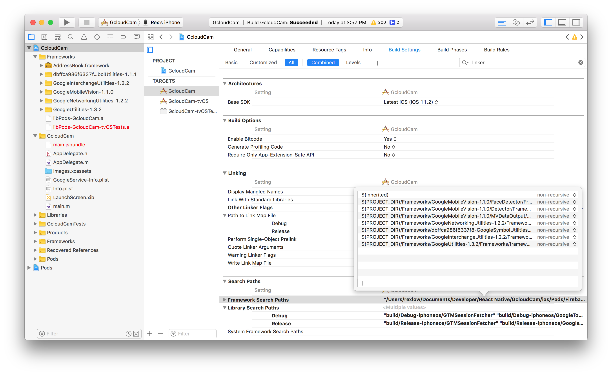

# GcloudCam

*A simple POC of capturing video and upload to Google Cloud Storage Bucket.*

## Modules Used

* [react-native-camera](https://github.com/react-native-community/react-native-camera) - record video
* [react-native-firebase](https://rnfirebase.io/docs/v3.2.x/installation/initial-setup) - upload video to cloud bucket
* [react-native-fs](https://github.com/itinance/react-native-fs) - remove file from device after uploaded


## Installation

* [react-native-camera](https://github.com/react-native-community/react-native-camera) (use manual installation, **react-native link** is sooooo broken)
* [react-native-firebase](https://rnfirebase.io/docs/v3.2.x/installation/initial-setup)
* [react-native-fs](https://github.com/itinance/react-native-fs) (link manually)

## Things to be aware of during installation
* Make sure all face detector frameworks are included and properly linked.
* Make sure all header paths shown in the image below are included (*for some reasons, even manual linking fails*)
* Remember to link and target **GoogleService-Info.plist**
* Remove Test Target if manual linking of **react-native-camera** fails
* Comment out **GcloudCam-tvOS** in Podfile (declared twice)


## Xcode Framework Search Paths

```
* $(PROJECT_DIR)/Frameworks/GoogleMobileVision-1.1.0/FaceDetector/Frameworks/frameworks
* $(PROJECT_DIR)/Frameworks/GoogleMobileVision-1.1.0/Detector/Frameworks/frameworks
* $(PROJECT_DIR)/Frameworks/GoogleMobileVision-1.1.0/MVDataOutput/Frameworks/frameworks
* $(PROJECT_DIR)/Frameworks/GoogleNetworkingUtilities-1.2.2/Frameworks/frameworks
* $(PROJECT_DIR)/Frameworks/dbffca986f6337f8-GoogleSymbolUtilities-1.1.1/Frameworks
* $(PROJECT_DIR)/Frameworks/GoogleInterchangeUtilities-1.2.2/Frameworks/frameworks
* $(PROJECT_DIR)/Frameworks/GoogleUtilities-1.3.2/Frameworks/frameworks
```

